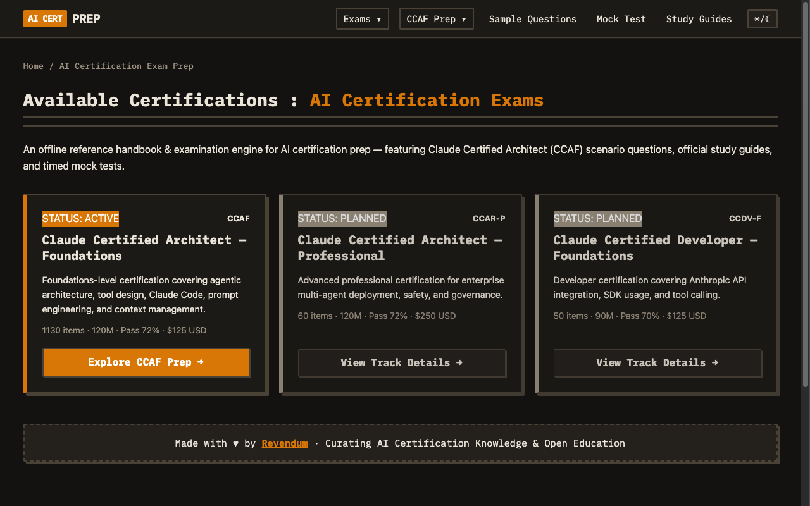
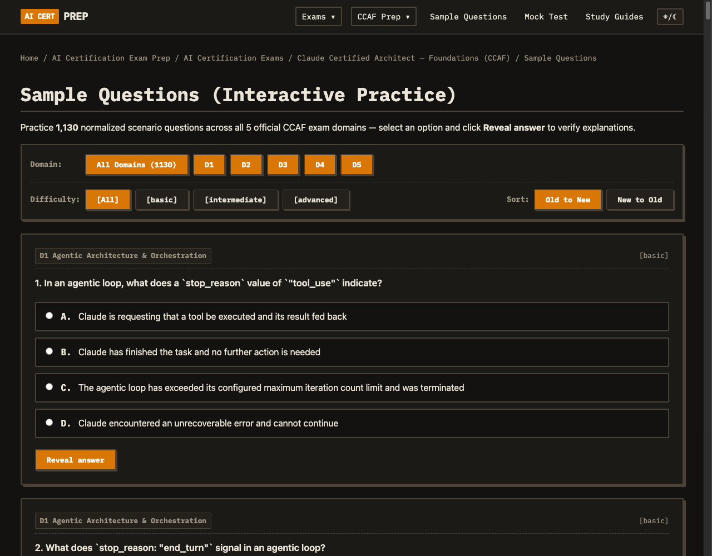
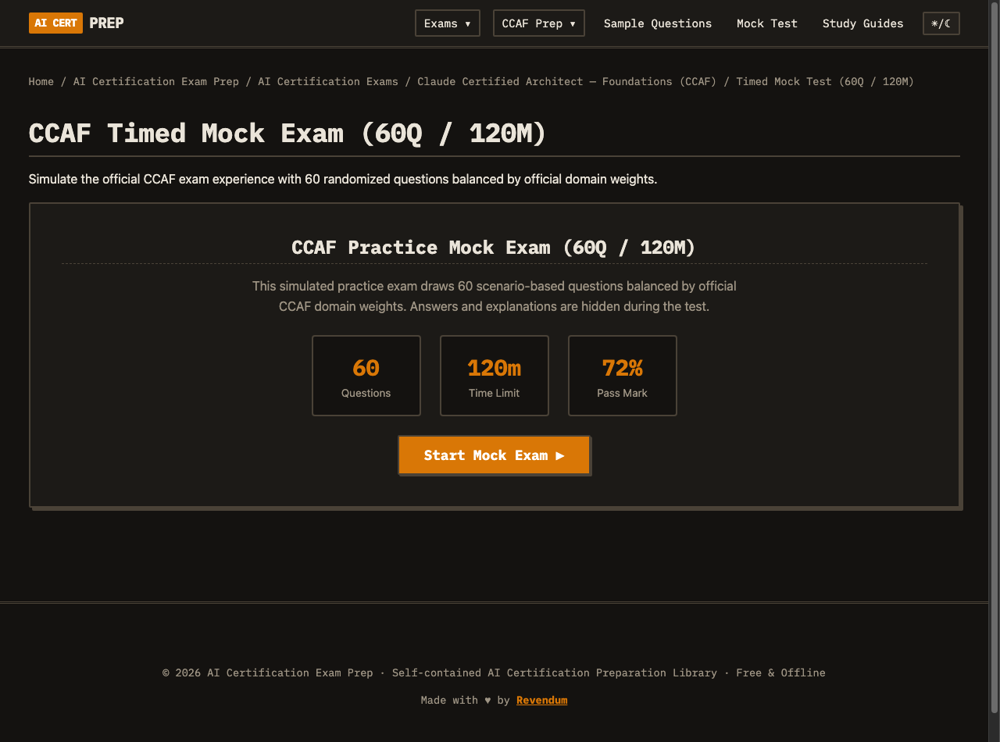
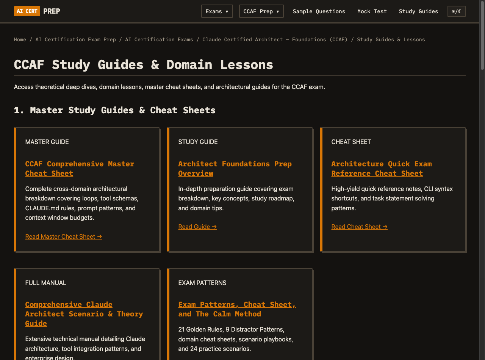

# 🕹️ AI Certification Exam Prep — Cyberspace Training Simulator

> **Jack in, boot your cyberdeck, and study like it's 1999.**  
> A self-contained, retro-styled AI certification preparation library and interactive exam simulator — 100% free, privacy-first, zero tokens needed, and fully offline-capable.

---

### 🌐 Live Cyberspace Terminal

**Boot the live website right in your browser:**  
### 🚀 **[https://imashishchawla.github.io/ai-certification-preparation/](https://imashishchawla.github.io/ai-certification-preparation/)**

- 💾 **100% Free Forever:** No paywalls, no paid courses, no sign-ups, no tracking cookies.
- ⚡ **Weekly Sync Pulse:** Automatically synchronizes, deduplicates, and validates new scenario questions **every Monday night at 00:00 UTC**.
- 🛸 **Offline Ready:** Zero server calls during mock exams or practice questions; everything runs client-side in pure static HTML/JS.

---

## 📺 Visual Terminal Deck (Screenshots)

### 1. The Holo-Deck Command Center
Explore all certification tracks, track status, exam durations, and domain breakdowns from a single retro dashboard.

---

### 2. Interactive Scenario Practice (1,130 Questions)
Filter by domain (D1 to D5), toggle difficulty tiers (`basic`, `intermediate`, `advanced`), test your reflexes, and click **Reveal answer** for comprehensive architectural rationale and official reference links.

---

### 3. Timed Arcade Mock Exam (Survival Mode)
Simulate the official proctored experience: 60 randomized questions, 120-minute countdown timer, domain-weighted distribution, and a 72% pass/fail grading protocol.

---

### 4. The Netrunner Archives (Study Guides & Lessons)
Complete 30-lesson structured curriculum, deep architectural breakdowns, 21 Golden Rules, distractor patterns, and master cheat sheets.

---

## 💾 Exam Matrix: Published vs. In Pipeline

### 🟢 Active & Operational Now

#### **Claude Certified Architect — Foundations (CCA-F / CCAR-F)**
- **1,130 Interactive Practice Questions:** Full coverage across all 5 official exam domains:
  - **D1 Agentic Architecture & Orchestration (27%)**
  - **D2 Tool Design & MCP (18%)**
  - **D3 Claude Code Config & Workflows (20%)**
  - **D4 Prompt Engineering & Structured Output (20%)**
  - **D5 Context Management & Reliability (15%)**
- **Timed Mock Simulator:** 60 questions, 120 minutes, domain-weighted, score reports.
- **30-Lesson Structured Curriculum:** Step-by-step deep dives covering loops, subagents, MCP servers, hooks, context budgeting, and prompt caching.
- **Master Cheat Sheets & Exam Notes:** 21 Golden Rules, distractor patterns, and the Calm Method scenario heuristics.
- **Official Documentation & PDF Compendiums:** Curated official exam guides and offline reference manuals.

---

### 🟡 In The Pipeline (Upcoming Missions)

- **Claude Certified Architect — Professional (CCAR-P):** Advanced multi-agent choreography, enterprise governance, high-scale evaluations, and security hardening.
- **Claude Certified Developer — Foundations (CCDV-F):** Direct SDK integrations, client tool schemas, API error handling, and streaming implementations.
- **Cross-Cloud AI Certifications:** Planned expansion into foundational AI engineering badges across major cloud platforms.

---

## 📊 Complete Database Breakdown by Source

Every single question in our bank is normalized, categorized by domain and difficulty, deduplicated, and verified against official specifications.

| Source ID | Source / Topic Description | Count | Percentage |
|---|---|---:|---:|
| `cca-prep-170` | Foundations Core Prep Set (170) | 170 | 15.0% |
| `foundations-prep-35` | Foundations Focused Architecture Question Set (35) | 35 | 3.1% |
| `architectural-eval-6` | Architectural Evaluation Scenarios (6) | 6 | 0.5% |
| `cca-prep-170-qu` | Foundations Extended Question Supplement (51) | 51 | 4.5% |
| `cca-400` | Comprehensive Architecture & Agentic Practice Question Bank (357) | 357 | 31.6% |
| `associate-prep-50` | Associate Architecture Preparation Suite (50) | 50 | 4.4% |
| `situational-scenarios-88` | Situational Scenario & Architecture Practice Bank (88) | 88 | 7.8% |
| `claude-architect-guide-257` | Claude Certified Architect Guide & Domain Drills (246) | 246 | 21.8% |
| `practice-exam-60` | Timed Mock Practice Exam (60) | 60 | 5.3% |
| `certyiq` | CertYIQ Practice Question Bank (45) | 45 | 4.0% |
| `calm-method-patterns` | Calm Method Heuristics & Exam Patterns Practice (22) | 22 | 1.9% |
| **TOTAL** | **Active Verified Question Bank** | **1,130** | **100.0%** |

---

## 🤝 Join the Cyberpunk Crew (Community & Collaborators)

Did we miss an architectural scenario, a key exam pattern, or a newly released feature? Found a typo or a glitch in the matrix? 

- 🐛 **Found an Issue / Missing Topic?** Please [open an Issue](https://github.com/imashishchawla/ai-certification-preparation/issues) or drop suggestions in [Discussions](https://github.com/imashishchawla/ai-certification-preparation/discussions).
- 🕹️ **Want to Add More Exams?** We are expanding to CCAR-P, CCDV-F, and more! If you would like to contribute scenario questions, review explanations, or design curriculum tracks, **we would love to have you as a collaborator**.
- 🌟 **Share the Signal:** If this helped you ace your exam, star the repository and share it with fellow netrunners!

---

  Built with ♥ for the global developer and AI architect community. 100% Free · Open Knowledge · Cyberpunk Spirit

