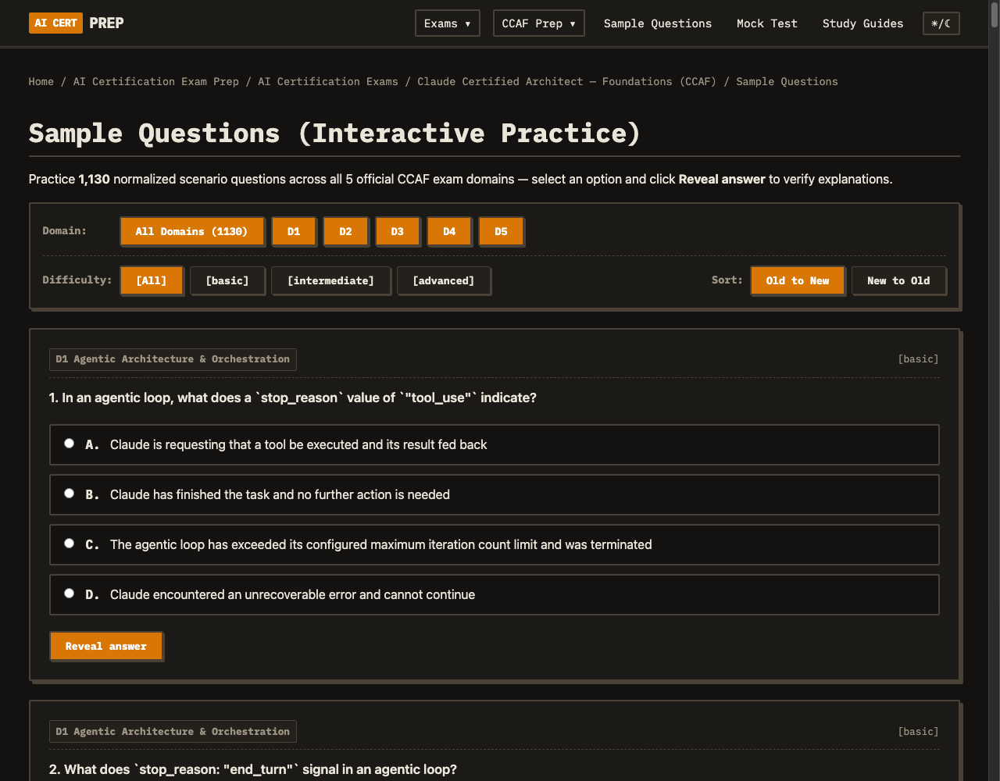
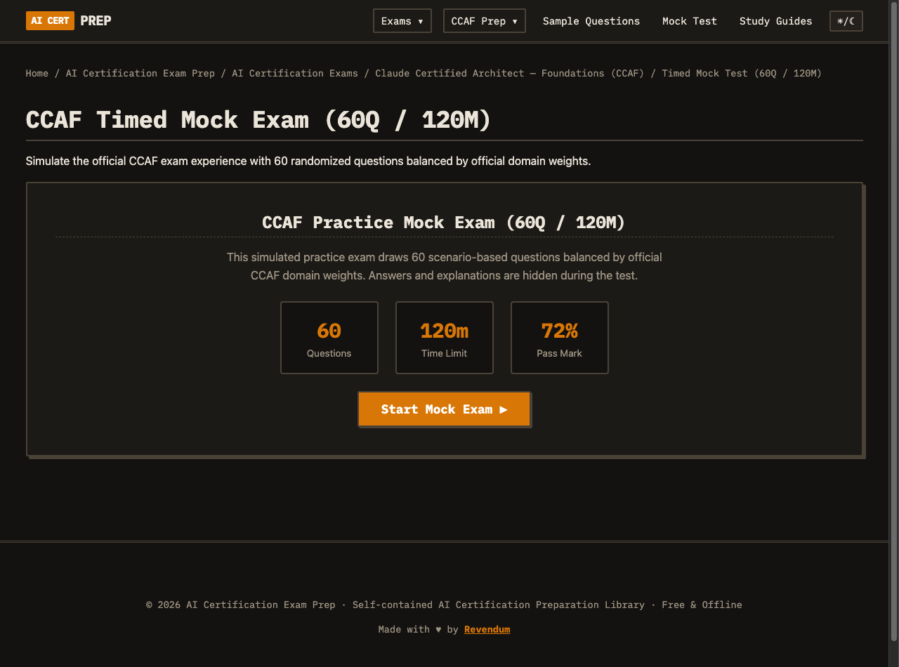
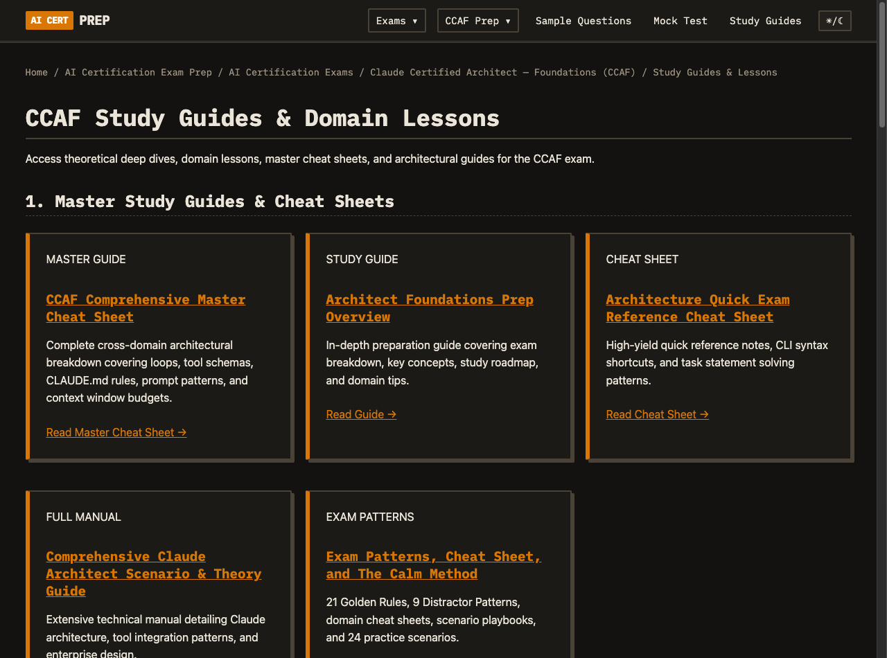

# Certification Prep — Practice Library

> Prepare for professional certifications in one place. Find focused study guides, practice questions, exam notes, and timed mock tests, organised into a clear learning path for each available certification.

---

### 🌐 [**https://imashishchawla.github.io/ai-certification-preparation/**](https://imashishchawla.github.io/ai-certification-preparation/)

- 💾 **100% Free :** No paywalls, no paid courses, no sign-ups, no tracking cookies.
- ⚡ **Weekly Sync Pulse:** Automatically synchronizes, deduplicates, and validates new scenario questions **every Sunday at 12:00 UTC (17:30 IST)**. The weekly metrics report follows on Monday at 08:30 IST.
- **One place to prepare:** Study material and practice tools are organized by certification track on the website.

---

<!-- WEEKLY-METRICS:START -->

### Weekly platform update

The first verified weekly snapshot will appear here after the scheduled report runs.

<!-- WEEKLY-METRICS:END -->

---

### 1. Interactive Scenario Practice

Filter by domain (D1 to D5) and the counted Quick Drills, Intermediate, or Difficult practice sets, then click **Reveal answer** for the rationale and references.

---

### 2. Timed Arcade Mock Exam (Survival Mode)

Practise with 60 questions, a 120-minute timer, and the official domain weights. This mock currently draws independent single-answer items; it does not yet reproduce the exam's four shared scenario blocks or multiple-response format.

---

### 4. The Netrunner Archives (Study Guides &amp; Lessons)

Complete 30-lesson structured curriculum, deep architectural breakdowns, 21 Golden Rules, distractor patterns, and master cheat sheets.

---

## 💾 Exam Matrix: Published vs. In Pipeline

### 🟢 Active &amp; Operational Now

#### **Claude Certified Architect — Foundations (CCAR-F; legacy code CCA-F)**

- **1,149 Interactive Practice Questions:** Coverage across all 5 official exam domains:
  - **D1 Agentic Architecture &amp; Orchestration (27%)**
  - **D2 Tool Design &amp; MCP (18%)**
  - **D3 Claude Code Config &amp; Workflows (20%)**
  - **D4 Prompt Engineering &amp; Structured Output (20%)**
  - **D5 Context Management &amp; Reliability (15%)**
- **Timed Mock Simulator:** 60 questions, 120-minute answer period, domain-weighted, with score reports.
- **30-Lesson Structured Curriculum:** Step-by-step deep dives covering loops, subagents, MCP servers, hooks, context budgeting, and prompt caching.
- **Master Cheat Sheets &amp; Exam Notes:** 21 Golden Rules, distractor patterns, and the Calm Method scenario heuristics.
- **Official Documentation &amp; PDF Compendiums:** Curated exam guides and reference material.

---

## 🤝 Join the Team (Community &amp; Collaborators)

Did we miss an architectural scenario, a key exam pattern, or a newly released feature? Found a typo or a glitch in the matrix? 

- 🐛 **Found an Issue / Missing Topic?** Please [open an Issue](https://github.com/imashishchawla/ai-certification-preparation/issues) or drop suggestions in [Discussions](https://github.com/imashishchawla/ai-certification-preparation/discussions).
- **Want to Add More Exams?** We are preparing additional AI and infrastructure study tracks. Contributions to reviewed questions, explanations, and learning paths are welcome.
- 🌟 **Share the Signal:** If this helped you ace your exam, star the repository and share it with fellow netrunners!

---

  Built with ♥ 

