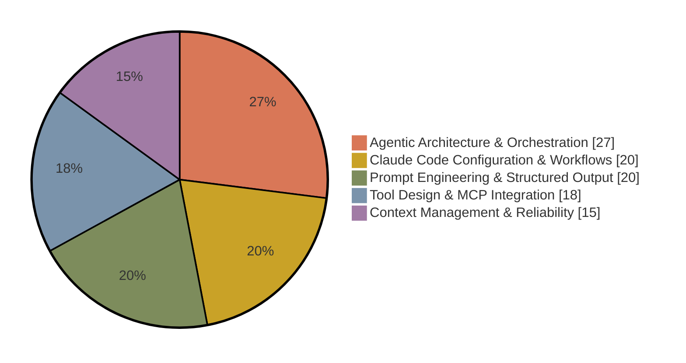

# Claude Certified Architect – Foundations

The Claude Certified Architect – Foundations certification validates that practitioners can make informed decisions about tradeoffs when implementing real-world solutions with Claude. It tests foundational knowledge across Claude Code, the Claude Agent SDK, the Claude API, and Model Context Protocol, the core technologies used to build production-grade applications with Claude.

This exam differs from the other three: every question is framed by one of six published production scenarios, and the exam guide is by far the most detailed of the four, with full task statements, preparation exercises, and an appendix of in-scope technologies. The [exam guide](/ai-certification-preparation/exams/cca-f/study-materials/) (version 1.0, effective July 2026) is the authoritative reference, and the maintainer's study notes for this exam are in [Exam Notes](/ai-certification-preparation/exams/cca-f/exam-notes/), with original practice questions in [Sample Questions](/ai-certification-preparation/exams/cca-f/sample-questions/) and a timed [Mock Test](/ai-certification-preparation/exams/cca-f/mock-test/). The [Cheat Sheet](/ai-certification-preparation/exams/cca-f/study-guides/cca-prep-cheatsheet/) condenses this whole page to one printable page for the day before.

## Exam facts

| Item | Detail |
| --- | --- |
| Exam code | CCAR-F |
| Questions | 60 multiple-choice and multiple-response items |
| Structure | 4 scenarios drawn at random from a published bank of 6 |
| Time limit | 120 minutes, with about 135 minutes of total seat time |
| Delivery | Pearson VUE, online proctored or at a test center |
| Passing score | 720 on a scaled range of 100 to 1,000 |
| Fee | 125 USD, before any partner-tier discount. Increased from 99 USD on June 30, 2026 |
| Validity | 12 months from the date you earn it |
| Prerequisites | None. No course is required |
| Language | English |

Registration requires a partner company email address recognized in the Claude Partner Network. This certification counts toward Claude Partner Network tier eligibility.

## Audience

The ideal candidate is a solution architect who designs and implements production applications with Claude, typically with six or more months of practical experience across the Claude API, Agent SDK, Claude Code, and MCP. The guide expects hands-on experience with multi-agent orchestration, Claude Code team configuration, MCP interface design, structured output engineering, context management, CI/CD integration, and escalation and reliability decisions.

## Skills measured

| # | Domain | Weight |
| :---: | --- | :---: |
| 1 | Agentic Architecture & Orchestration | 27% |
| 2 | Tool Design & MCP Integration | 18% |
| 3 | Claude Code Configuration & Workflows | 20% |
| 4 | Prompt Engineering & Structured Output | 20% |
| 5 | Context Management & Reliability | 15% |

Task statements per domain, condensed from section 6 of the guide:

**Domain 1: Agentic Architecture & Orchestration (27%)**

1.1 Design and implement agentic loops for autonomous task execution. 1.2 Orchestrate multi-agent systems with coordinator and subagent patterns. 1.3 Configure subagent invocation, context passing, and spawning. 1.4 Implement multi-step workflows with enforcement and handoff. 1.5 Apply Agent SDK hooks for tool call interception. 1.6 Design task decomposition strategies. 1.7 Manage session state, resumption, and forking.

**Domain 2: Tool Design & MCP Integration (18%)**

2.1 Design tool interfaces with clear descriptions. 2.2 Implement structured error responses for MCP tools. 2.3 Distribute tools across agents and configure tool access. 2.4 Integrate MCP servers into Claude Code and agent workflows. 2.5 Select and apply the built-in tools (Read, Write, Edit, Bash, Grep, Glob).

**Domain 3: Claude Code Configuration & Workflows (20%)**

3.1 Configure CLAUDE.md hierarchy and scoping. 3.2 Create custom slash commands and skills. 3.3 Apply path-specific rules for conditional convention loading. 3.4 Choose between plan mode and direct execution. 3.5 Apply iterative refinement techniques. 3.6 Integrate Claude Code into CI/CD pipelines.

**Domain 4: Prompt Engineering & Structured Output (20%)**

4.1 Design prompts with explicit criteria. 4.2 Apply few-shot prompting for consistency. 4.3 Enforce structured output using tool use and JSON schemas. 4.4 Implement validation, retry, and feedback loops for extraction. 4.5 Design batch processing strategies. 4.6 Design multi-instance and multi-pass review architectures.

**Domain 5: Context Management & Reliability (15%)**

5.1 Manage conversation context to preserve critical information. 5.2 Design escalation and ambiguity resolution patterns. 5.3 Implement error propagation across multi-agent systems. 5.4 Manage context in large codebase exploration. 5.5 Design human review workflows and confidence calibration. 5.6 Preserve information provenance and handle uncertainty.

## The six exam scenarios

> [!TIP]
> This is the largest preparation advantage available on any of the four exams: the scenarios are published in advance, and four of these six frame every question you will see. Rehearse each one until its likely questions are predictable.

Four of these six published scenarios appear on each exam sitting, selected at random. Knowing them in advance is an unusual and significant preparation advantage.

| # | Scenario | Primary domains |
| :---: | --- | --- |
| 1 | Customer support resolution agent built on the Agent SDK, with MCP tools such as get_customer, lookup_order, process_refund, and escalate_to_human, targeting 80%+ first-contact resolution | 1, 2, 5 |
| 2 | Code generation with Claude Code: slash commands, CLAUDE.md configuration, plan mode versus direct execution | 3, 5 |
| 3 | Multi-agent research system: a coordinator delegating to search, analysis, synthesis, and report subagents producing cited reports | 1, 2, 5 |
| 4 | Developer productivity tooling on the Agent SDK using the built-in tools and MCP servers for codebase exploration and automation | 2, 3, 1 |
| 5 | Claude Code in CI/CD: automated code review, test generation, and pull request feedback with low false-positive prompting | 3, 4 |
| 6 | Structured data extraction from unstructured documents with JSON schema validation and downstream integration | 4, 5 |

## Technologies named in the appendix

The guide's appendix lists what may appear on the exam. Highlights worth studying deliberately:

- **Agent SDK:** agentic loops, stop_reason handling ("tool_use" versus "end_turn"), PostToolUse hooks, subagent spawning via the Task tool, allowedTools configuration
- **MCP:** servers, tools, resources, the isError flag, tool descriptions and distribution, .mcp.json, environment variable expansion
- **Claude Code:** the CLAUDE.md hierarchy (user, project, directory), .claude/rules/ with YAML frontmatter path scoping, .claude/commands/, .claude/skills/ with SKILL.md frontmatter (context: fork, allowed-tools, argument-hint), plan mode, /memory, /compact, --resume, fork_session, the Explore subagent
- **Claude Code CLI:** -p or --print for non-interactive use, --output-format json, --json-schema for structured CI output
- **API:** tool_use with JSON schemas, tool_choice options, max_tokens, system prompts
- **Message Batches API:** 50% cost savings, up to 24-hour window, custom_id correlation, no multi-turn tool calling
- **Supporting concepts:** JSON Schema design (required versus optional, enums, nullable fields, "other" plus detail patterns, strict mode), Pydantic validation-retry loops, few-shot prompting, prompt chaining, token budgets and lost-in-the-middle effects, scratchpad files, session management, and confidence scoring with calibration

## Official documents

| Document | Local copy | Source |
| --- | --- | --- |
| Exam guide | [Official Guide PDF](/ai-certification-preparation/exams/cca-f/study-materials/) | [Partner Academy certifications page](https://anthropic-partners.skilljar.com/page/partner-certifications) |
| Exam policy | [Official Policy](/ai-certification-preparation/exams/cca-f/study-materials/) | Same page |
| Terms and conditions | [Terms & Conditions](/ai-certification-preparation/exams/cca-f/study-materials/) | Same page |

Registration: [Claude Certified Architect – Foundations Certification](https://anthropic-partners.skilljar.com/claude-certified-architect-foundations-certification). Prep courses: [Architect – Foundations prep courses](https://anthropic-partners.skilljar.com/page/claude-certified-architect-foundations-prep-courses). The registration process itself is described in [Registration Information](https://anthropic-partners.skilljar.com/).

## Preparing

Everything above restates official material. The advice below is this repository's recommendation.

1. Read the exam guide in full. At 39 pages it is the longest of the four and the only one containing scenario descriptions, per-task knowledge lists, preparation exercises, and a technology appendix. Treat it as the syllabus, because it is one.
2. Study the six scenarios until you can predict what each one will ask about. Each names its primary domains, so you can rehearse the intersection: for example, scenario 1 combines agent orchestration, MCP tool design, and escalation patterns.
3. Do the guide's own preparation exercises in section 8: build an Agent SDK agent with a complete loop, configure Claude Code for a real project including .claude/rules/ and an MCP server, design MCP tools with structured errors, and build a schema-validated extraction pipeline with a validation-retry loop.
4. Work through the appendix list and confirm you can explain and use every named item. Items as specific as the isError flag, fork_session, and --json-schema are called out because they are testable.
5. Work the sample questions in section 9 with their rationales.

Points worth noting before you schedule:

- Agentic Architecture & Orchestration is the heaviest domain at 27%. Combined with Tool Design & MCP Integration, nearly half the exam is agent and tool design.
- If you attempted this exam before June 30, 2026 and did not pass, the earlier failed attempt was cleared in the Pearson migration and you can register without a waiting period.
- Anthropic describes this certification as proving an architect can build with Claude, while [Architect – Professional](/ai-certification-preparation/exams/ccar-p/) proves they can design and govern solutions at enterprise scale. There is no prerequisite in either direction and Foundations does not upgrade automatically.

## Related certifications

- [Developer – Foundations](/ai-certification-preparation/exams/ccdv-f/), which tests overlapping technologies from an implementation perspective
- [Claude Certified Architect – Professional](/ai-certification-preparation/exams/ccar-p/), the next step for enterprise-scale design and governance
- [Associate – Foundations](/ai-certification-preparation/), for non-developers who apply Claude to business workflows

---

Facts last verified against the official sources on 2026-09-18. [Exam Center](/ai-certification-preparation/)
