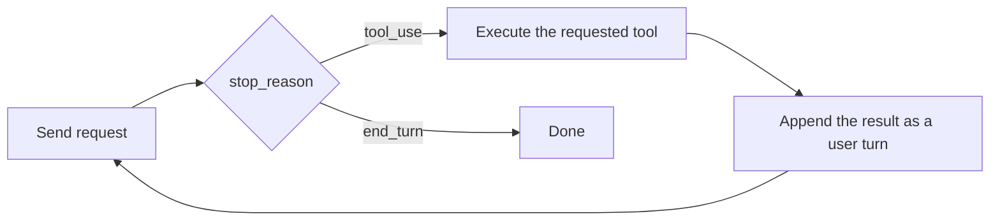
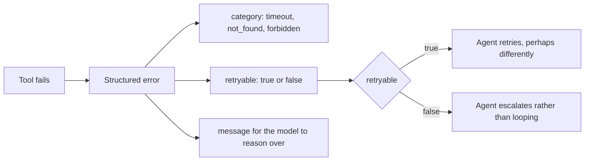

# Study notes: Architect – Foundations

My working notes from preparing for this exam. This is the exam where preparation pays off most directly, because the six scenarios are published in advance and the guide's appendix names the testable technologies. Nothing here comes from the live exam, which is covered by a non-disclosure agreement; everything traces to the [exam guide](exam-guide.pdf).

## Work the scenarios, not just the domains

Four of the six published scenarios appear per sitting. For each one I wrote down what it must ask about, then studied that intersection. The short version:

| Scenario | What it forces you to know |
| --- | --- |
| Support resolution agent | Agent loop design, MCP tool boundaries (get_customer, process_refund), when to escalate versus resolve, least privilege on refund-class tools |
| Claude Code for development | CLAUDE.md hierarchy, slash commands, plan mode versus direct execution, iterative refinement |
| Multi-agent research | Coordinator and subagent orchestration, context passing, provenance and citation preservation, error propagation |
| Developer productivity tooling | Built-in tool selection (Read, Write, Bash, Grep, Glob), MCP server integration, codebase-scale context management |
| Claude Code in CI/CD | Headless mode (-p, --output-format json, --json-schema), review prompts with explicit criteria, false-positive control, multi-pass review |
| Structured data extraction | tool_use with JSON schemas, validation-retry loops, optional and nullable fields, batch processing |

## The agentic loop, precisely

The details that distinguish right answers: tool results go back as part of the conversation history so the model can reason over them; loop termination needs an explicit condition beyond hoping for end_turn; hooks (for example PostToolUse) intercept tool calls for validation, logging, or blocking; subagents are spawned for delegation and context isolation, with allowedTools scoping what each may touch.

## MCP tool design rules of thumb

- A tool description is the interface contract; write it so the model can choose correctly between similar tools on the first try.
- Errors are data: return structured error responses with a category and a retryable flag, and use the isError flag rather than burying failure in prose. The model can only recover from errors it can interpret.
- Distribute tools by role: the agent that drafts replies does not need process_refund. Removing a capability entirely beats guarding it.
- Configuration lives in .mcp.json, including environment variable expansion for secrets.

## Claude Code configuration, the testable surface

- CLAUDE.md hierarchy: user level, project level, directory level; more specific wins. Path-scoped conventions go in .claude/rules/ with YAML frontmatter, loading only when matching files are touched.
- Custom commands in .claude/commands/; Skills in .claude/skills/ with SKILL.md frontmatter, where context: fork, allowed-tools, and argument-hint are the options the guide names.
- Plan mode for work you want reviewed before execution, direct execution for well-understood changes. /compact manages long sessions, --resume and fork_session manage session state.
- CI usage is non-interactive: -p or --print, --output-format json, and --json-schema to force machine-readable review output.

## Structured output patterns

- Enforce shape with tool_use plus a JSON schema rather than asking nicely for JSON. tool_choice can force the tool call.
- Schema design is judgment: required fields for what must exist, nullable or optional for what may not, enums plus an "other" with a detail string for open sets.
- The reliability loop: validate (Pydantic or equivalent), feed validation errors back, retry; measure error rates with a labeled sample rather than trusting spot checks; attach confidence and route low-confidence extractions to human review.
- Bulk work goes through the Message Batches API: half cost, 24-hour window, custom_id correlation, and no multi-turn tool calling inside a batch.

## Context and reliability

**What a failing tool should return.** The shape of an error decides whether
the agent can do anything useful with it.

A stack trace tells the agent nothing it can act on. A category and a retryable
flag let it decide, which is the difference between a loop that recovers and a
loop that spins.

- Long tasks: extract structured facts from verbose tool output as you go, keep a scratchpad file for durable state, and delegate subtasks to subagents so the main context stays clean. Beware lost-in-the-middle: critical facts belong at the edges of the window.
- Escalation is a design decision made in advance: policy gaps, explicit customer requests, and inability to progress are escalation triggers; everything else resolves autonomously with logging.
- In multi-agent systems, errors must propagate with enough context for the coordinator to decide retry, reroute, or abort; provenance (which source said what) survives handoffs only if you design for it.

## Recall list

60 questions across 4 of 6 published scenarios, 120 minutes, 720 of 1,000 to pass, $125 list (was $99 before June 30, 2026), counts toward partner tier, pre-migration failed attempts cleared, credential valid 12 months with free renewal.

---

These notes are the maintainer's own summary and carry no official standing. [Study guide](README.md) · [Repository index](../README.md)
